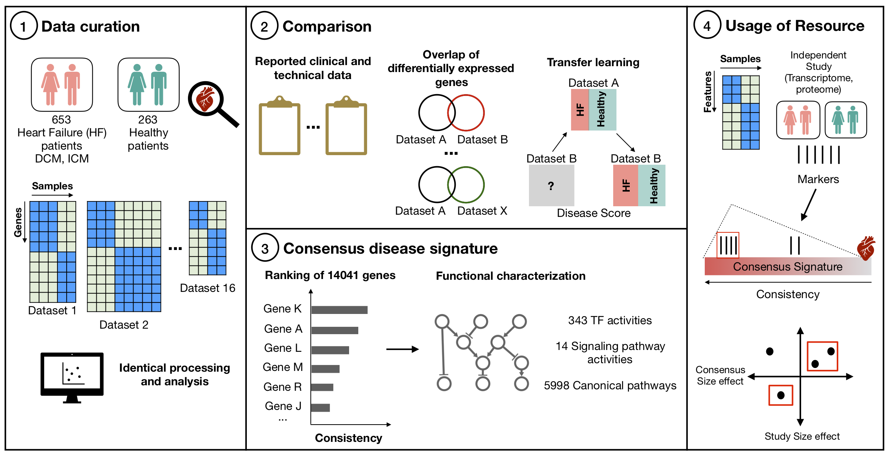

## Welcome to **RefHF**, the Reference for the Heart Failure transcriptome

### Abstract

RefHF is a user friendly portal to explore, analyze and download the transcriptional consensus signature of human end-stage heart failure consensus signature (HF-CS).

The HF-CS is based on a meta-analysis of 16 independent studies. 

### Method

We curated and uniformly processed 16 public transcriptomic studies of left ventricular samples from 263 healthy and 653 failing human hearts. Transfer learning approaches revealed conserved disease patterns across all studies independent of technical differences. We meta-analyzed the dysregulation of 14041 genes to extract a consensus signature of HF. Estimation of the activities of 343 transcription factors, 14 signalling pathways, and 182 micro RNAs, as well as the enrichment of 5998 biological processes confirmed the established aspects of the functional landscape of the disease and revealed novel ones. In RefHF, we provide all results as a public resource to facilitate further use and interpretation of the results. 

This resource can be leveraged in many ways, please refer to the original publication for examples where we investigate i) fetal gene reprogramming and ii) myocardial origin of the plasma proteome using the HF-CS.

### Graphical abstract

### Citation
> TODO
