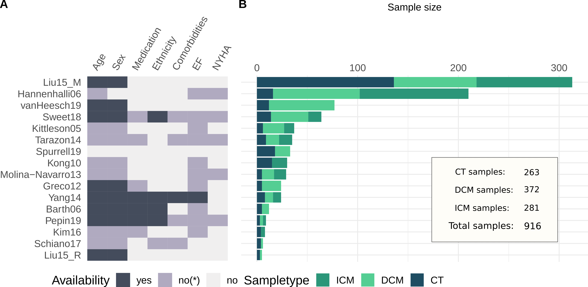
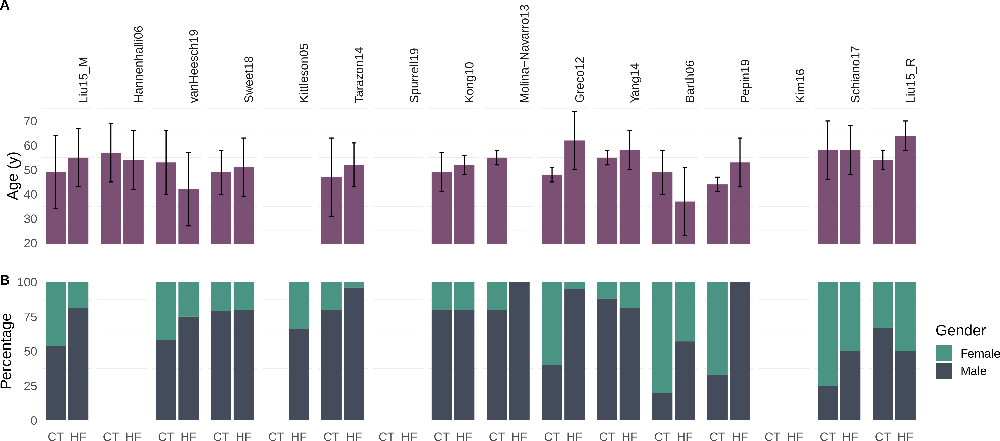
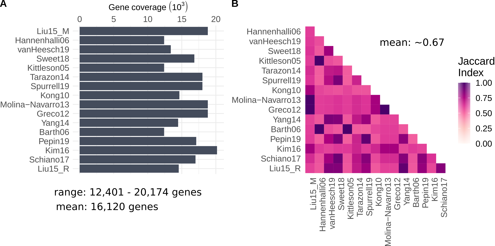

***

### Infographic of study information

&nbsp;

**A** Sample information availability per study. yes, information per sample; no* = incomplete information or only summary statistics; no, no information available. When reported, EF was  <40% and NYHA classification ranged between III and IV.   **B** Sample size comparison of studies. CT, Control; ICM, ischemic cardiomyopathy; DCM, dilatative cardiomyopathy.

&nbsp;

***

### Age and gender distribution per study

&nbsp;

**A** Age distribution in years of control (CT) and heart failure samples (HF) per study. Displayed is mean and standard deviation. **B** Gender of patients in % per study. Missing information is left blank.

&nbsp;

***

### Overview of gene coverage of studies included in meta-analysis

&nbsp;

**A** Absolute gene coverage per study after processing. **B** Pairwise comparison of covered genes measured with Jaccard Index. 

